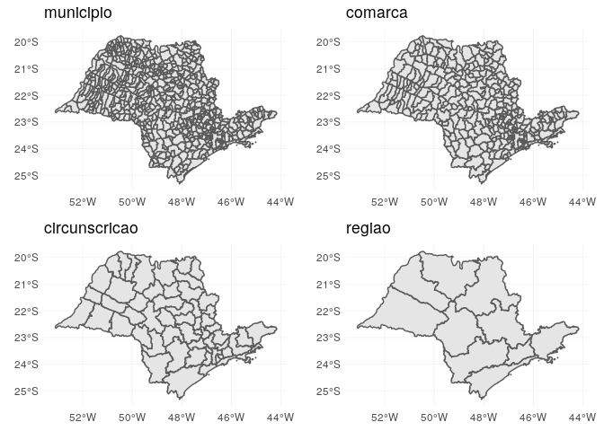
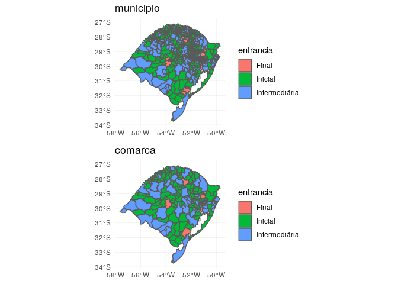

[](https://travis-ci.org/abjur/abjMaps)

abjMaps
=======

The goal of abjMaps is to make beautiful jurimetrics maps using simple features (`sf` package).

Actually, only Tribunal de Justiça de São Paulo is implemented. Look at the `data-raw/comarcas_tjsp.R` file do see how we organized the data.

Installation
------------

You can install abjMaps from github with:

``` r
# install.packages("devtools")
devtools::install_github("abjur/abjMaps")
```

Example
-------

TJSP:

``` r
library(abjMaps)
library(tidyverse)
#> ── Attaching packages ───────────────────────────────────────────── tidyverse 1.2.1 ──
#> ✔ ggplot2 2.2.1.9000     ✔ purrr   0.2.5     
#> ✔ tibble  1.4.2          ✔ dplyr   0.7.6     
#> ✔ tidyr   0.8.1          ✔ stringr 1.3.1     
#> ✔ readr   1.1.1          ✔ forcats 0.3.0
#> ── Conflicts ──────────────────────────────────────────────── tidyverse_conflicts() ──
#> ✖ dplyr::filter() masks stats::filter()
#> ✖ dplyr::lag()    masks stats::lag()
d_sf
#> # A tibble: 4 x 2
#>   nivel         sf                
#>   <chr>         <list>            
#> 1 municipio     <sf [645 × 12]>   
#> 2 comarca       <tibble [319 × 3]>
#> 3 circunscricao <tibble [57 × 2]> 
#> 4 regiao        <tibble [10 × 2]>
```

``` r
graphs <- purrr::pmap(d_sf, ~{
  ggplot(..2) +        
    geom_sf() +       
    ggtitle(..1) +     
    theme_minimal() 
})
gridExtra::grid.arrange(grobs = graphs)
```



TJRS:

``` r
graphs <- purrr::pmap(d_sf_tjrs, ~{
  ggplot(..2) +        
    geom_sf(aes(fill = entrancia)) +       
    ggtitle(..1) +     
    theme_minimal() 
})
gridExtra::grid.arrange(grobs = graphs, ncol = 1)
```



Citation
--------

To cite `abjMaps`, write `citation("abjMaps")`:

    To cite package ‘abjMaps’ in publications use:

      Julio Trecenti and Fernando Correa (2017). abjMaps: Organizing Data To Create
      Jurimetric Maps. R package version 0.1.9000.

    A BibTeX entry for LaTeX users is

      @Manual{,
        title = {abjMaps: Organizing Data To Create Jurimetric Maps},
        author = {Julio Trecenti and Fernando Correa},
        year = {2017},
        note = {R package version 0.1.9000},
      }
