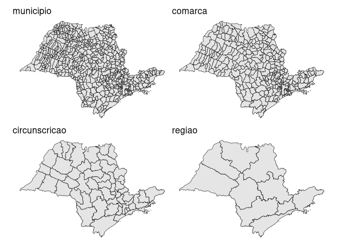
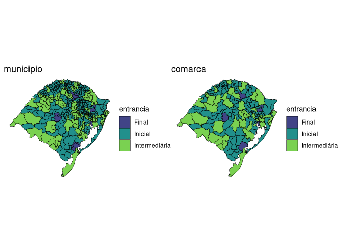

<!-- badges: start -->

[](https://github.com/abjur/abjMaps/actions)
<!-- badges: end -->

# abjMaps <a href='http://abjur.github.io/abjMaps/'></a>

## Visão geral

O objetivo do `{abjMaps}` é possibilitar a criação de mapas jurimétricos
utilizando-se de recursos do pacote `sf` (contém ferramentas para
armazenamento e acesso de características geográficas).

Para enriquecer a análise, são incluídos dados relativos aos estados,
municípios e comarcas do Brasil. Até o momento, estão implementadas as
bases para o TJSP e o TJRS.

Veja o arquivo `data-raw/comarcas_tjsp.R` para ver como organizamos
nossos dados.

## Para instalar

Você pode instalar a versão mais recente do `{abjMaps}` com:

``` r
# install.packages("devtools")
devtools::install_github("abjur/abjMaps")
```

## Como usar

Para ilustrar, segue-se exemplos de uso:

Tribunal de Justiça de São Paulo:

``` r
library(abjMaps)
library(sf)
#> Linking to GEOS 3.8.0, GDAL 3.0.4, PROJ 6.3.2
d_sf
#> # A tibble: 4 x 2
#>   nivel         sf                  
#>   <chr>         <named list>        
#> 1 municipio     <sf[,12] [645 × 12]>
#> 2 comarca       <tibble [319 × 3]>  
#> 3 circunscricao <tibble [57 × 2]>   
#> 4 regiao        <tibble [10 × 2]>
```

``` r
graphs <- purrr::pmap(d_sf, ~{
  ggplot2::ggplot(..2) +        
    ggplot2::geom_sf(
      colour = "black",
      size = .2
    ) +       
    ggplot2::ggtitle(..1) +     
    ggplot2::theme_void() 
})
patchwork::wrap_plots(graphs)
```

<!-- -->

Tribunal de Justiça do Rio Grande do Sul:

``` r
graphs <- purrr::pmap(d_sf_tjrs, ~{
  ggplot2::ggplot(..2) +        
    ggplot2::geom_sf(
      ggplot2::aes(fill = entrancia),
      colour = "black",
      size = .2
    ) +       
    ggplot2::scale_fill_viridis_d(begin = .2, end = .8) +
    ggplot2::ggtitle(..1) +
    ggplot2::theme_void() 
})
patchwork::wrap_plots(graphs)
```

<!-- -->

## Requisitos

`{abjMaps}` requer uma versão do R superior ou igual a 3.4.0.

## Licença

O `{abjMaps}` é licenciado sob os termos da
[MIT](https://github.com/abjur/abjMaps/blob/master/LICENSE)

### Citation

To cite `abjMaps`, write `citation("abjMaps")`:

    To cite package ‘abjMaps’ in publications use:

      Julio Trecenti and Fernando Correa (2017). abjMaps: Organizing Data To Create
      Jurimetric Maps. R package version 0.1.9000.

    A BibTeX entry for LaTeX users is

      @Manual{,
        title = {abjMaps: Organizing Data To Create Jurimetric Maps},
        author = {Julio Trecenti and Fernando Correa},
        year = {2017},
        note = {R package version 0.1.9000},
      }
